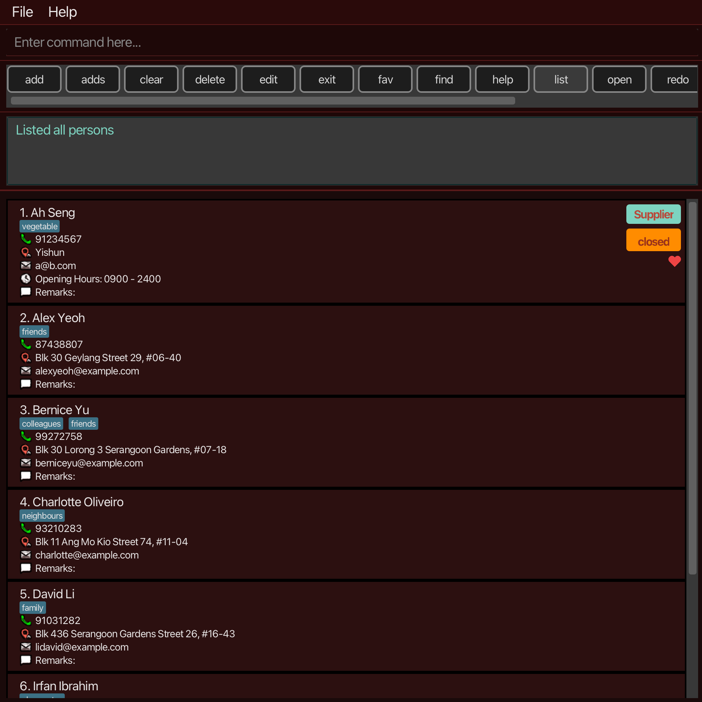

* MALAdress helps hawker stall owners quickly store, update and retrieve supplier and regular-customer contacts in one place, optimized for fast CLI workflows during busy service hours. Reduce missed calls, supplier mix-ups, and time wasted digging through chat apps or paper notes. 

* Features:
  * Add contacts
  * List contacts
  * Find contacts
  * Edit contacts
  * Delete contacts
  * Tag as customer / supplier
  * List all currently available supplier
  * Find help

* Acknowledgement:
This project is based on the AddressBook-Level3 project created by the [SE-EDU initiative](https://se-education.org).
