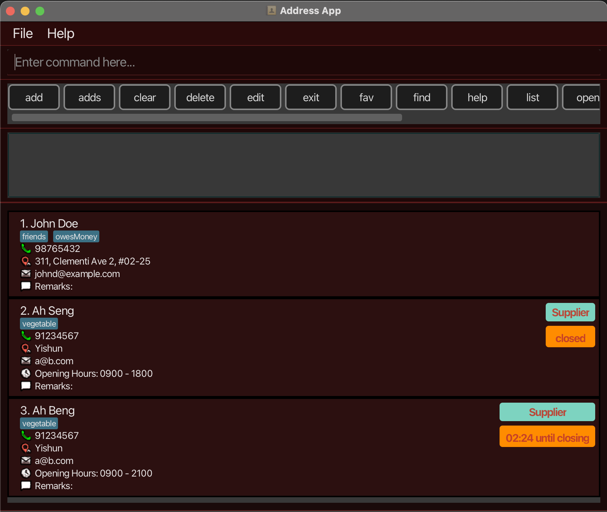
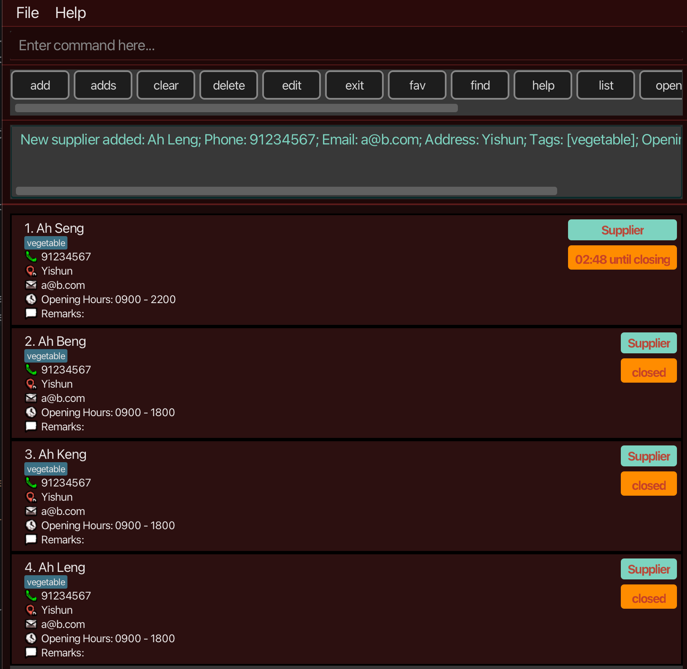
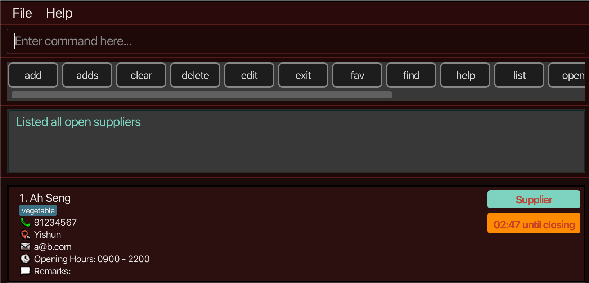
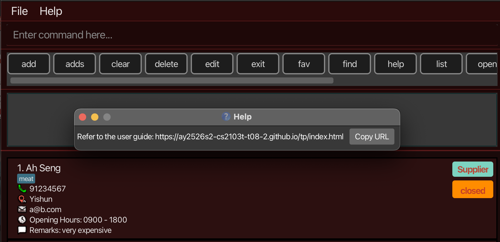
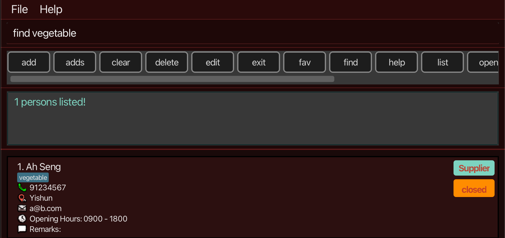
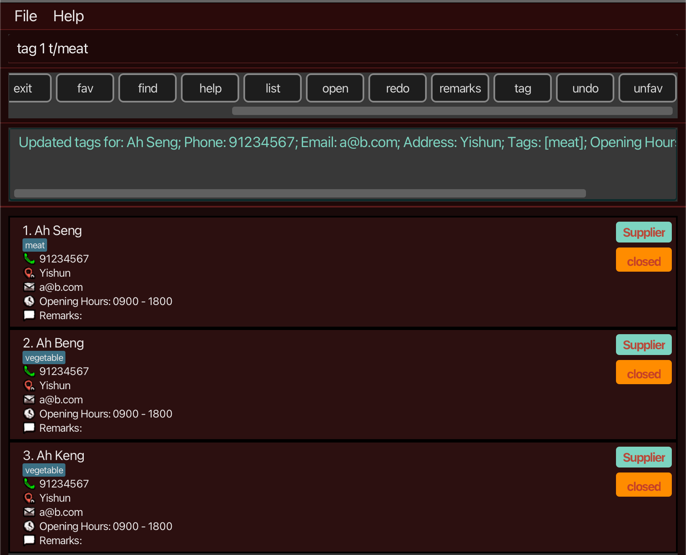
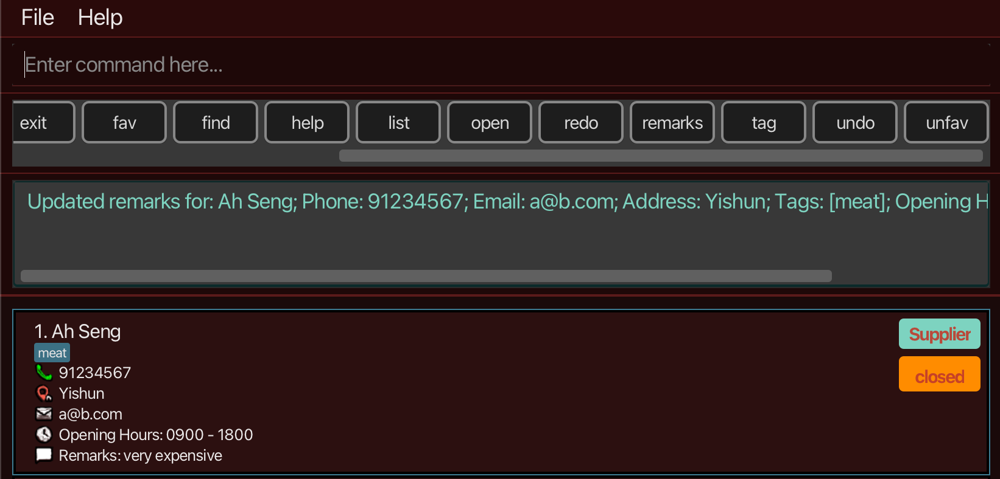
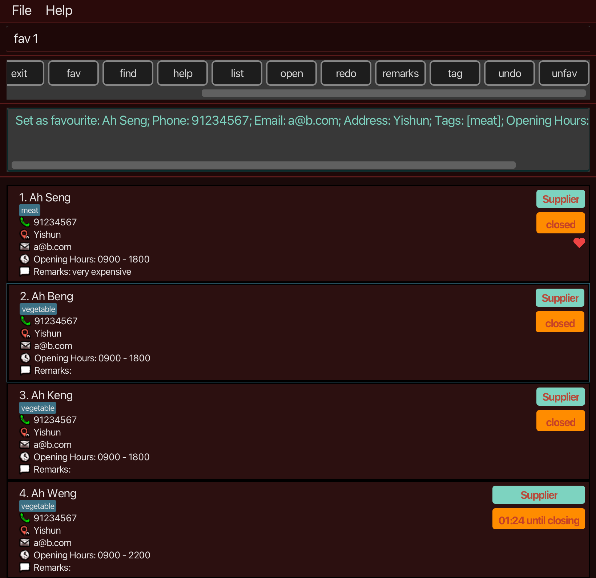

# MALAdress User Guide

<!-- * Table of Contents -->
<page-nav-print />

--------------------------------------------------------------------------------------------------------------------

## 1. Introduction

MALAddress is a desktop address book application for hawker stall owners and stall assistants, optimized for fast Command Line Interface (CLI) workflows while still providing the benefits of a Graphical User Interface (GUI).
It helps users manage supplier contacts efficiently during daily operations by enabling quick keyboard-based access to contact details, checking supplier availability before contacting to prevent disturbances during off working hours, and reducing the risk of stock shortages through faster, more reliable contact management.

--------------------------------------------------------------------------------------------------------------------

## 2. Quick Start

### Step 1: Installation
1. Ensure Java 17 or above is installed on your computer.
2. Download the latest `.jar` file from your team’s GitHub Releases page.
3. Copy the `.jar` file to a folder you want to use as the home directory of MALAddress.

Note:
- Double-clicking the jar might not work on some systems. Use the terminal command below instead.
- Do not place the jar in a write-protected folder (the app needs permission to write the data file).

### Step 2: Launching the Application
1. Open a terminal.
2. `cd` into the folder containing the jar.
3. Run:
   `java -jar maladdress.jar`

A GUI similar to the following should appear:

### Step 3: Understanding the Interface
- Command Box: enter commands here.
- Contact List Panel: shows stored contacts.
- Result Display: shows feedback after each command.

### Step 4: Try Your First Task
1. Type: `list`
2. Add a supplier:
   `adds n/Ah Seng p/91234567 e/a@b.com a/Yishun o/0900 - 1800 t/vegetable`
3. Check open suppliers:
   `open`

--------------------------------------------------------------------------------------------------------------------

## 3. Common Tasks

### Adding a New Supplier
Use `adds` to store supplier details (including opening hours) so the supplier can appear in `open`.

### Finding a Contact Quickly
Use `find` to search by keywords across name, phone, email, address, tags, and remarks.

### Checking Which Suppliers Are Open
Use `open` to filter to suppliers that are currently available (“open now”).

--------------------------------------------------------------------------------------------------------------------

## 4. Features

### 4.1 Notes about Command Format
- Words in UPPER_CASE are parameters you supply.
  Example: `adds n/NAME p/PHONE ...`
- Items in square brackets are optional.
- Items with `...` can appear multiple times (including zero times).
- Parameters can be in any order unless stated otherwise.
- Extra parameters for commands that do not take parameters (e.g., `help`, `list`, `open`, `clear`) will be ignored.
- Commands are case-sensitive by default for command words (type them as shown).

### 4.2 Viewing Help: `help`
Use this command to view available commands and their formats.

Format:
`help`

Expected Output:
A help window is displayed with a list of commands and formats.

--------------------------------------------------------------------------------------------------------------------

### 4.3 Adding a Contact: `add`
Use this command to add a general contact.

Format:
`add n/NAME p/PHONE e/EMAIL a/ADDRESS [t/TAG]...`

Expected Output:
The contact list updates with the new contact.

Example:
`add n/John Doe p/98765432 e/johnd@example.com a/311, Clementi Ave 2, #02-25 t/friends t/owesMoney`

--------------------------------------------------------------------------------------------------------------------

### 4.4 Adding a Supplier: `adds`
Use this command to add a supplier contact with opening hours, so that `open` can work correctly.

Format:
`adds n/NAME p/PHONE e/EMAIL a/ADDRESS o/OPENING_HOURS t/TAG [t/TAG]...`

Notes:
- Opening hours must be in the format `HHmm - HHmm` (example: `0900 - 1800`).
- Suppliers must have at least one tag.

Expected Output:
The supplier appears in the contact list with opening hours and tags shown.

Example:
`adds n/Ah Seng p/91234567 e/a@b.com a/Yishun o/0900 - 2200 t/vegetable`

--------------------------------------------------------------------------------------------------------------------

### 4.5 Listing Contacts: `list`
Use this command to show all contacts.

Format:
`list`

Expected Output:
All contacts are displayed in the contact list panel.

--------------------------------------------------------------------------------------------------------------------

### 4.6 Finding Contacts: `find`
Use this command to locate contacts quickly using keywords.

Format:
`find KEYWORD [MORE_KEYWORDS]`

Search behaviour:
- Case-insensitive.
- Matches if any keyword appears in any of:
  name, phone, email, address, tags, remarks.

Expected Output:
Only matching contacts are displayed.

Example:
`find vegetable`

--------------------------------------------------------------------------------------------------------------------

### 4.7 Editing a Contact: `edit`
Use this command to update contact details.

Format:
`edit INDEX [n/NAME] [p/PHONE] [e/EMAIL] [a/ADDRESS] [o/OPENING_HOURS]`

Notes:
- INDEX refers to the number shown in the current list.
- Opening hours should only be used for suppliers.
- Tags cannot be edited using `edit`. Use `tag` instead.

Expected Output:
The selected contact’s details are updated.

Example:
`edit 1 p/98765432 e/new@email.com`

Example (supplier opening hours):
`edit 1 o/1000 - 1900`

--------------------------------------------------------------------------------------------------------------------

### 4.8 Tagging a Contact: `tag`
Use this command to replace the tags of a contact.

Format:
`tag INDEX t/TAG [t/TAG]...`

What it does:
- Replaces the tags of the person at INDEX with the provided tags.

Expected Output:
The selected contact’s tags are updated and shown in the contact card/list.

Example:
`tag 3 t/vegetable t/fruits`

Step 1:
Run `list` (or `find ...`) so you can see the correct INDEX.
Step 2:
Run `tag INDEX t/...` to replace the tags.

--------------------------------------------------------------------------------------------------------------------

### 4.9 Listing Open Suppliers: `open`
Use this command to see all suppliers that are available at the current time.

Format:
`open`

Warning:
Suppliers without correctly formatted opening hours may not appear.

Expected Output:
The contact list updates to show only currently available/open suppliers.

Example:
`open`

Step 1:
Add suppliers using `adds` with valid opening hours.
Step 2:
Run `open` to filter suppliers that are open now.

--------------------------------------------------------------------------------------------------------------------

### 4.10 Updating Remarks: `remarks`
Use this command to replace the remarks of a contact.

Format:
`remarks INDEX r/REMARKS`

Expected Output:
The selected contact’s remarks are updated.

Example:
`remarks 2 r/very expensive`

To clear remarks:
`remarks 2 r/`

--------------------------------------------------------------------------------------------------------------------

### 4.11 Favourites: `fav`
Use this command to mark/unmark a contact as a favourite.

Format:
`fav INDEX`

Expected Output:
The contact is toggled as favourite (favourite indicator updates).

Example:
`fav 2`

--------------------------------------------------------------------------------------------------------------------

### 4.12 Undo and Redo: `undo`, `redo`
Use these commands to undo or redo your most recent changes.

Format:
`undo`
`redo`

What it does:
- `undo` restores the address book to the previous state.
- `redo` re-applies the last undone change.

Expected Output:
- The contact list updates to reflect the restored/re-applied state.

Example:
1) `delete 2`
2) `undo` (restores the deleted contact)
3) `redo` (deletes it again)

--------------------------------------------------------------------------------------------------------------------

### 4.13 Deleting a Contact: `delete`
Format:
`delete INDEX`

Deletes the person at the specified INDEX.
The index refers to the index number shown in the displayed person list.
The index must be a positive integer 1, 2, 3, …

Expected Output:
The selected contact is removed from the list.

Example:
1) `list` followed by `delete 2` deletes the 2nd person in the address book.

--------------------------------------------------------------------------------------------------------------------

### 4.14 Clearing All Contacts: `clear`
Clears all contacts from the address book. This removes every contact currently stored and resets the displayed list to empty.

Format:
`clear`

Expected Output:
The contact list becomes empty.

Example:
`clear`

--------------------------------------------------------------------------------------------------------------------

## 5. Data Management

### Saving Data
All changes are saved automatically. No manual saving is required.

### Editing the Data File
Data is stored at:
`[JAR file location]/data/addressbook.json`

Warning:
Invalid edits may cause data loss.

--------------------------------------------------------------------------------------------------------------------

## 6. FAQ

Q: How do I transfer my data to another computer?

A: Install the app in the other computer and overwrite the empty data file it creates with the file that contains the data of your previous MALAddress home folder.

--------------------------------------------------------------------------------------------------------------------

## 7. Known Issues
1. When using multiple screens, the GUI may open off-screen after changing monitor setup.
   Remedy: delete `preferences.json` and restart.
2. Mac users using fullscreen mode for secondary dialogs (e.g., Help) may encounter unexpected behaviour.
   Remedy: exit fullscreen before opening the dialog.

--------------------------------------------------------------------------------------------------------------------

## 8. Command Summary

Action | Format, Examples
---|---
Help | `help`
Add | `add n/NAME p/PHONE e/EMAIL a/ADDRESS [t/TAG]...`
Add Supplier | `adds n/NAME p/PHONE e/EMAIL a/ADDRESS o/HHmm - HHmm t/TAG [t/TAG]...`
List | `list`
Find | `find KEYWORD [MORE_KEYWORDS]`
Edit | `edit INDEX [n/NAME] [p/PHONE] [e/EMAIL] [a/ADDRESS] [o/HHmm - HHmm]`
Tag | `tag INDEX t/TAG [t/TAG]...`
Open | `open`
Remarks | `remarks INDEX r/REMARKS`
Favourite | `fav INDEX`
Undo | `undo`
Redo | `redo`
Delete | `delete INDEX`
Clear | `clear`

--------------------------------------------------------------------------------------------------------------------

## 9. Glossary

Term | Definition
---|---
Hawker stall | A small food business operating from a stall in a hawker centre/food court, common in Singapore/Malaysia.
Supplier | A contact that provides ingredients/services to the stall.
Tag | A short label used to classify contacts (e.g., vegetable, seafood, friend).
Remarks | A short note attached to a contact (e.g., “always late”, “deliver before 10am”).
Opening hours | Supplier availability window in the format `HHmm - HHmm` (e.g., `0900 - 1800`).
Open supplier | A supplier whose opening hours include the current time.
Favourite | A contact marked as important (shown with a favourite indicator).
